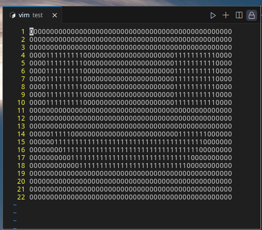

# BITMAP to C array

This is a -hopefully- non bloated bitmap to C array. Takes a file as an input and prints the corresponding C array

## Description

When developing LCD drivers for embedded systems, sometimes there's a need to have pre-defined graphics inside ROM. A way of storing these graphics, would be as an array.   

## Getting Started

Create a .txt file (like the image bellow), fill it with 1 and 0's representing your graphic and save it. Then execute the program with the path to your file and an option for the type of the array

### Installing

* C++ 11
* CMake

### Executing program

./bitmapToCArray ../figures/face.txt 1

## Version History

* 1.0
    * Initial Release

## License

This project is licensed under the MIT License - see the LICENSE file for details
